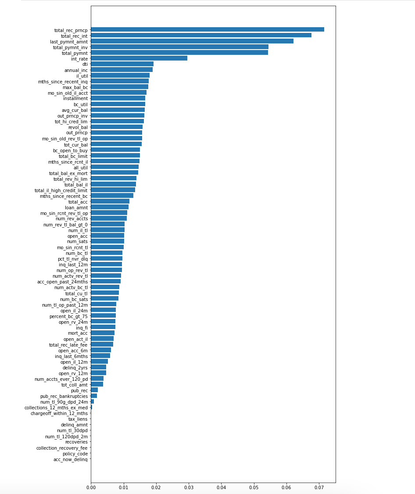

# Machine Learning

## Table of Contents

1. [Background](#background)
2. [Resampling](#Resampling)
3. [Ensemble Learning](#Ensemble-Learning)

## Background

Mortgages, student and auto loans, and debt consolidation are just a few examples of credit and loans that people seek online. Peer-to-peer lending services such as Loans Canada and Mogo let investors loan people money without using a bank. However, because investors always want to mitigate risk, a client has asked that you help them predict credit risk with machine learning techniques.

In this project you will build and evaluate several machine learning models to predict credit risk using data you'd typically see from peer-to-peer lending services. Credit risk is an inherently imbalanced classification problem (the number of good loans is much larger than the number of at-risk loans), so you will need to employ different techniques for training and evaluating models with imbalanced classes. You will use the imbalanced-learn and Scikit-learn libraries to build and evaluate models using the two following techniques:

## Resampling

Use the [imbalanced learn](https://imbalanced-learn.readthedocs.io) library to resample the LendingClub data and build and evaluate logistic regression classifiers using the resampled data.

To begin:

- Read the CSV into a DataFrame.
```python
# Load the data
file_path = Path('Resources/lending_data.csv')
df = pd.read_csv(file_path)
```
- Split the data into Training and Testing sets.
```python
# Create our features
X = df.copy()
X.drop(columns = ["loan_status", "homeowner"], axis= 1, inplace = True)

# Create our target
y = df["loan_status"]

# Create X_train, X_test, y_train, y_test
X_train, X_test, y_train, y_test = train_test_split(X,y,random_state = 1, stratify =y)
```
- Scale the training and testing data using the `StandardScaler` from `sklearn.preprocessing`.
```python
# Create the StandardScaler instance
scaler = StandardScaler()

# Fit the Standard Scaler with the training data
# When fitting scaling functions, only train on the training dataset
X_scaler = scaler.fit(X_train)

# Scale the training and testing data
X_train_scaled = X_scaler.transform(X_train)
X_test_scaled = X_scaler.transform(X_test)
```
- Use the provided code to run a Simple Logistic Regression:
* Fit the `logistic regression classifier`.
```python
# Train the Logistic Regression model
lr_model = LogisticRegression(solver='lbfgs', random_state=1)
lr_model.fit(X_train, y_train)
```
* Calculate the `balanced accuracy score`.
```python
# Calculated the balanced accuracy score
y_pred_lr = lr_model.predict(X_test)
lr_score = balanced_accuracy_score(y_test, y_pred_lr)
lr_score
```
* Display the `confusion matrix`.
```python
# Display the confusion matrix
confusion_matrix(y_test, y_pred_lr)
```
* Print the `imbalanced classification report`.
```python
# Print the imbalanced classification report
print(classification_report_imbalanced(y_test, y_pred_lr))
```

Next you will:

### Oversample the data using the `Naive Random Oversampler` algorithm.

```python
# Resample the training data with the RandomOverSampler
# View the count of target classes with Counter
ros_model = RandomOverSampler(random_state = 1)
X_resampled, y_resampled = ros_model.fit_resample(X_train, y_train)

# Train the Logistic Regression model using the resampled data
ros_model = LogisticRegression(solver = 'lbfgs', random_state = 1)
ros_model.fit(X_resampled, y_resampled)

# Calculated the balanced accuracy score
y_pred_ros = ros_model.predict(X_resampled)
ros_score = balanced_accuracy_score(y_resampled, y_pred_ros)
ros_score

# Display the confusion matrix
confusion_matrix(y_resampled, y_pred_ros)

# Print the imbalanced classification report
print(classification_report_imbalanced(y_resampled, y_pred_ros))
```
### Oversample the data using the `SMOTE` algorithm.

```python
# Resample the training data with SMOTE
X_resampled, y_resampled = SMOTE(random_state = 1, sampling_strategy = 1.0).fit_resample(X_train, y_train)

# Train the Logistic Regression model using the resampled data
SMOTE_model = LogisticRegression(solver = 'lbfgs', random_state = 1)
SMOTE_model.fit(X_resampled, y_resampled)

# Calculated the balanced accuracy score
y_pred_SMOTE = SMOTE_model.predict(X_resampled)
SMOTE_score = balanced_accuracy_score(y_resampled, y_pred_SMOTE)
SMOTE_score

# Display the confusion matrix
confusion_matrix(y_resampled, y_pred_SMOTE)

# Print the imbalanced classification report
print(classification_report_imbalanced(y_resampled, y_pred_SMOTE))
```
### Undersample the data using the `Cluster Centroids` algorithm.

```python
# Resample the data using the ClusterCentroids resampler
cc_model = ClusterCentroids(random_state = 1)
X_resampled, y_resampled = cc_model.fit_resample(X_train, y_train)

# Train the Logistic Regression model using the resampled data
cc_model = LogisticRegression(solver = 'lbfgs', random_state = 1)
cc_model.fit(X_resampled, y_resampled)

# Calculate the balanced accuracy score
y_pred_cc = cc_model.predict(X_resampled)
cc_score = balanced_accuracy_score(y_resampled, y_pred_cc)
cc_score

# Display the confusion matrix
confusion_matrix(y_resampled, y_pred_cc)

# Print the imbalanced classification report
print(classification_report_imbalanced(y_resampled, y_pred_cc))
```
### Over- and undersample using a combination `SMOTEENN` algorithm.

```python
# Resample the training data with SMOTEENN
SMOTEENN_model = SMOTEENN(random_state = 1)
X_resampled, y_resampled = SMOTEENN_model.fit_resample(X_train, y_train)

# Train the Logistic Regression model using the resampled data
SMOTEENN_model = LogisticRegression(solver = 'lbfgs', random_state = 1)
SMOTEENN_model.fit(X_resampled, y_resampled)

# Calculate the balanced accuracy score
y_pred_SMOTEENN = SMOTEENN_model.predict(X_resampled)
SMOTEENN_score = balanced_accuracy_score(y_resampled, y_pred_SMOTEENN)
SMOTEENN_score

# Display the confusion matrix
confusion_matrix(y_resampled, y_pred_SMOTEENN)

# Print the imbalanced classification report
print(classification_report_imbalanced(y_resampled, y_pred_SMOTEENN))
```

Use the above to answer the following questions:

* Which model had the best balanced accuracy score?
    - SMOTEENN Model
* Which model had the best recall score?
    - SMOTEENN Model
* Which model had the best geometric mean score?
    - SMOTEENN Model

## Ensemble Learning

In this section, you will train and compare two different ensemble classifiers to predict loan risk and evaluate each model. You will use the [Balanced Random Forest Classifier](https://imbalanced-learn.org/stable/references/generated/imblearn.ensemble.BalancedRandomForestClassifier.html) and the [Easy Ensemble Classifier](https://imbalanced-learn.org/stable/references/generated/imblearn.ensemble.EasyEnsembleClassifier.html). Refer to the documentation for each of these to read about the models and see examples of the code.

To begin:

- Read the data into a DataFrame using the provided starter code.
```python
# Load the data
file_path = Path('Resources/LoanStats_2019Q1.csv')
df = pd.read_csv(file_path)
```
- Split the data into training and testing sets.
```python
# Create our features
X = df.drop(columns = ["loan_status", "home_ownership", "verification_status", "issue_d", "pymnt_plan", "initial_list_status", "next_pymnt_d", "application_type", "hardship_flag","debt_settlement_flag"])

# Create our target
y = df["loan_status"]

# Split the X and y into X_train, X_test, y_train, y_test
X_train, X_test, y_train, y_test = train_test_split(X, y, random_state = 1, stratify = y)
```
- Scale the training and testing data using the `StandardScaler` from `sklearn.preprocessing`.
```python
# Create the StandardScaler instance
scaler = StandardScaler()

# Fit the Standard Scaler with the training data
# When fitting scaling functions, only train on the training dataset
X_scaler = scaler.fit(X_train)

# Scale the training and testing data
X_train_scaled = X_scaler.transform(X_train)
X_test_scaled = X_scaler.transform(X_test)
```

Then, complete the following steps for each model:
### Part one: Balanced Random Forest Classifier
- Train the model using the quarterly data from LendingClub provided in the `Resource` folder.
```python
# Resample the training data with the BalancedRandomForestClassifier
brfc_model = BalancedRandomForestClassifier(n_estimators = 1000, random_state = 1)
brfc_model.fit(X_train_scaled, y_train)
Counter(y_train)
```
- Calculate the balanced accuracy score from `sklearn.metrics`.
```python
# Calculated the balanced accuracy score
y_pred_brfc = brfc_model.predict(X_test_scaled)
balanced_accuracy_score(y_test, y_pred_brfc)
```
- Display the confusion matrix from `sklearn.metrics`.
```python
# Display the confusion matrix
confusion_matrix(y_test, y_pred_brfc)
```
- Generate a classification report using the `imbalanced_classification_report` from imbalanced learn.
```python
# Print the imbalanced classification report
print(classification_report_imbalanced(y_test, y_pred_brfc))
```
- For the balanced random forest classifier only, print the feature importance sorted in descending order (most important feature to least important) along with the feature score.



```python
# List the features sorted in descending order by feature importance
importances = brf_model.feature_importances_
indices = np.argsort(importances)
fig, ax = plt.subplots(figsize=(10,20))
ax.barh(range(len(importances)), importances[indices])
ax.set_yticks(range(len(importances)))
_ = ax.set_yticklabels(np.array(X_train.columns)[indices])
```

### Part Two: Easy Ensemble Classifier
```python
# Train the Classifier
eec_model = EasyEnsembleClassifier(random_state = 1)
eec_model.fit(X_train, y_train)

# Calculated the balanced accuracy score
y_pred_eec = eec_model.predict(X_test)
print(balanced_accuracy_score(y_test, y_pred_eec))

# Display the confusion matrix
confusion_matrix(y_test, y_pred_eec)

# Print the imbalanced classification report
print(classification_report_imbalanced(y_test, y_pred_eec))
```
Use the above to answer the following questions:

* Which model had the best balanced accuracy score?
    - Balanced Random Forest Classifier
* Which model had the best recall score?
    - Balanced Random Forest Classifier
* Which model had the best geometric mean score?
    - Balanced Random Forest Classifier
* What are the top three features?
    - total_rec_prncp, total_rec_int, last_pymnt_amnt
- - -

© 2021 Trilogy Education Services, a 2U, Inc. brand. All Rights Reserved.
